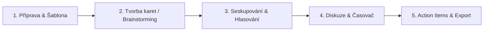
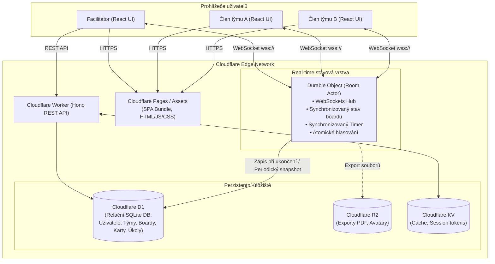
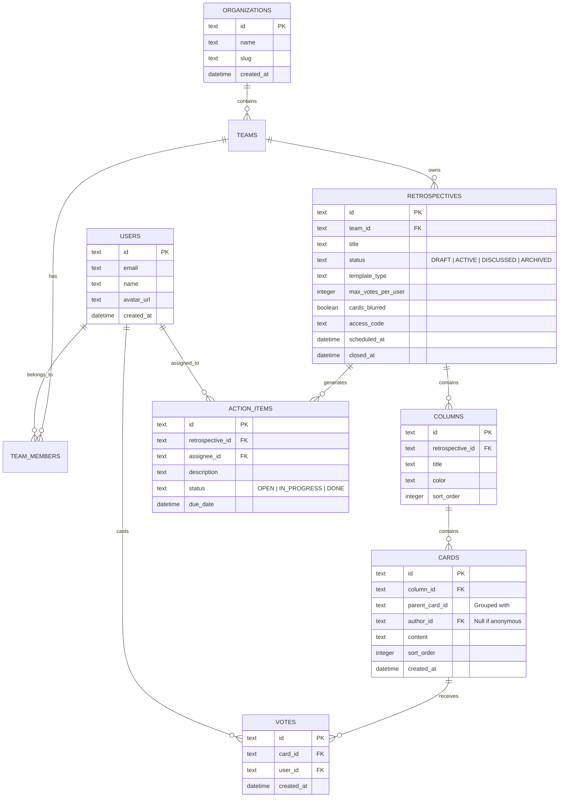
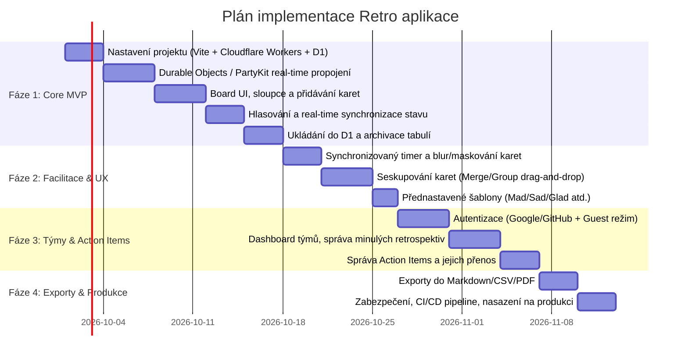

# Návrh architektury a analýza proveditelnosti: Retro Board (EasyRetro alternativa) na Cloudflare

Tento dokument obsahuje detailní analýzu proveditelnosti, architektonický návrh, datový model a technologický stack pro moderní real-time aplikaci na agilní retrospektivy (inspirováno [EasyRetro.io](https://easyretro.io/)) s plným využitím ekosystému **Cloudflare**.

---

## 1. Manažerské shrnutí a analýza proveditelnosti (Feasibility Study)

### 1.1 Verdikt proveditelnosti: **100% PROVEDITELNÉ** (Vysoká vhodnost)
Implementace retrospektivní aplikace na platformě Cloudflare je nejen plně proveditelná, ale představuje v současnosti **technologicky i nákladově nejefektivnější řešení na trhu**. 

Cloudflare eliminuje nutnost spravovat klasické virtuální servery (VPS), kontejnerové clustery (Kubernetes) nebo platit drahé managed servery pro WebSockets a Redis.

### 1.2 Porovnání tradiční architektury vs. Cloudflare Serverless Edge

| Aspekt | Tradiční architektura (Node.js/Redis/VPS) | Cloudflare Edge Architektura (Workers/DO/D1) | Výhoda Cloudflare |
| :--- | :--- | :--- | :--- |
| **Real-time WebSockets** | Dedikovaný Node.js/Go server + Redis Pub/Sub | **Cloudflare Durable Objects** (stateful edge rooms) | Nulová správa instancí, room-based škálování |
| **Globální latence** | 100–250 ms (podle polohy datacentra) | **< 30 ms** (kód běží na 300+ edge uzlech po celém světě) | Blesková odezva při psaní a hlasování |
| **Perzistence a DB** | PostgreSQL na AWS RDS / Supabase | **Cloudflare D1** (Serverless SQLite) + DO SQLite | Nulové poplatky za idle čas, těsná integrace |
| **Hosting Frontendu** | Vercel / Netlify / S3 + CloudFront | **Cloudflare Pages / Workers Assets** | Neomezený bandwidth zdarma, 1 klik deploy |
| **Počáteční náklady** | $15–$50 / měsíc (i bez provozu) | **0 $ / měsíc** (ve Free tieru) | Ideální pro MVP i růst |

### 1.3 Finanční a kapacitní limity (Free Tier vs. Paid Tier)

* **Cloudflare Workers & Pages**:
  * *Free tier:* 100 000 requestů/den, neomezený Pages bandwidth.
  * *Paid ($5/měsíc):* 10 milionů requestů v ceně ($0.50 za další milion).
* **Cloudflare Durable Objects (DO)**:
  * *Free tier:* 1 milion požadavků/měsíc, 400 000 GB-sekund compute, 5 GB storage.
  * *Chování:* Jedna retrospektivní místnost běží jako jeden Durable Object pouze po dobu trvání schůzky (cca 45–60 min).
* **Cloudflare D1 (SQLite DB)**:
  * *Free tier:* 5 000 000 čtení/den, 100 000 zápisů/den, 5 GB kapacity.
  * *Kapacita:* Pro tisíce uložených retrospektiv a stovek týmů je Free tier více než dostačující pro první měsíce až roky provozu.

---

## 2. Funkční specifikace (Inspirace EasyRetro)

Aplikace pokrývá klíčové procesy agilní retrospektivy rozdělené do několika fází:

### Klíčové moduly:
1. **Board & Šablony**:
   * Přednastavené šablony: *Went Well / To Improve / Action Items*, *Mad / Sad / Glad*, *Start / Stop / Continue*, *4Ls (Liked, Learned, Lacked, Longed for)*, *Sailboat*.
   * Možnost vytvářet a upravovat vlastní sloupce (včetně barev a limitů).
2. **Karty & Anonymita**:
   * Přidávání karet pod jménem nebo plně anonymně.
   * **Blur / Maskování karet**: Text karet je skrytý, dokud facilitátor neodemkne fázi odhalení (zabraňuje ovlivňování týmu během brainstormingu).
3. **Seskupování (Card Grouping)**:
   * Drag-and-drop sloučení podobných myšlenek do jedné skupiny s jedním hlavním tématem.
4. **Hlasovací systém (Voting)**:
   * Nastavitelný počet hlasů na účastníka (např. 3–5 hlasů).
   * Zamezení hlasování o vlastních kartách (volitelné).
   * Přehledné řazení karet v reálném čase podle počtu obdržených hlasů.
5. **Facilitátorské nástroje & Synchronizovaný časovač**:
   * Synchronizovaný countdown timer viditelný pro všechny připojené členy.
   * Řízení fází facilitátorem (Zápis -> Hlasování -> Diskuze -> Hotovo).
6. **Správa a historie retrospektiv**:
   * Dashboard týmů: ukládání minulých retrospektiv, možnost kdykoliv otevřít archiv.
   * Sledování a přenášení nedokončených **Action Items** do další retrospektivy.
   * Exporty: CSV, Markdown, PDF, webhook do Slacku nebo Jira.

---

## 3. Technologická architektura

Architektura staví na principu **Edge Actor Pattern** pomocí Cloudflare Durable Objects pro real-time synchronizaci a **Serverless SQLite (D1)** pro perzistentní data.

### 3.1 Proč Durable Objects (nebo PartyKit)?
U kolaborativních tabulí potřebujete:
1. **Nulovou latenci**: Změny v textu, přesun karet a kliknutí na hlasování se musí okamžitě promítnout ostatním.
2. **Konzistenci bez kolizí (Race Conditions)**: Pokud má účastník limit 5 hlasů a klikne 5x rychle za sebou, server musí garantovat, že nepřekročí limit. Durable Object je **jednovláknový stavový proces (actor)**, který zaručuje sekvenční a atomické zpracování zpráv bez potřeby distribuovaných zámků v databázi.
3. **Efektivitu perzistence**: Během aktivní 45minutové retrospektivy se udělají stovky drobných změn (hýbání myší, psaní, přetahování). Durable Object drží stav v paměti / lokálním SQLite v rámci DO a do hlavní databáze D1 provádí debounced/batch snapshoty. Tím se šetří limity zápisů do hlavní DB.

> [!TIP]
> **PartyKit** je open-source knihovna přímo pod křídly Cloudflare, která abstrakci nad Durable Objects a WebSockets zjednodušuje na jednotky řádků kódu (metody `onConnect`, `onMessage`, `broadcast`). Lze ji nasadit přímo na váš Cloudflare účet.

---

## 4. Datový model (Cloudflare D1)

Relační schéma navržené pro **Cloudflare D1** pomocí **Drizzle ORM**:

---

## 5. Doporučený technologický stack

| Vrstva | Doporučená technologie | Alternativa | Důvod volby |
| :--- | :--- | :--- | :--- |
| **Frontend Framework** | **React + Vite (SPA)** na Cloudflare Pages | Next.js (OpenNext) / SvelteKit | Maximální rychlost buildu, čisté oddělení API, 100% kompatibilita s Cloudflare Pages CDN. |
| **Styling & UI** | **Vanilla CSS + CSS Modules** nebo **Tailwind CSS** + **Radix UI** | Shadcn/UI | Moderní, čisté komponenty, přístupnost (a11y), snadný Dark Mode. |
| **Drag and Drop** | **@dnd-kit/core** | react-beautiful-dnd | Moderní, přístupná knihovna pro přetahování karet a sloupců s plynulou animací. |
| **Realtime Engine** | **Cloudflare Durable Objects / PartyKit** | Standalone Worker WebSockets | Nativní podpora WebSockets na Edge, atomický stav místnosti, nulová režie. |
| **Edge API Router** | **Hono** (na Cloudflare Workers) | Itty-router | Neuvěřitelně lehký (~12KB), typově bezpečný, nejpopulárnější router pro Cloudflare. |
| **ORM & Schéma** | **Drizzle ORM + D1** | Prisma (edge client) | Nativní podpora Cloudflare D1, nulový overhead, type-safe SQL dotazy a migrace. |
| **Autentizace** | **Better-Auth** nebo **Auth.js / Clerk** | Supabase Auth / Magic link | Jednoduché přihlášení (Google/GitHub/Magic link) + anonymní hostující relace (Guest PIN). |

---

## 6. Bezpečnost a řízení přístupů

1. **Hostující (Guest) přístup bez nutnosti registrace**:
   * Podobně jako v EasyRetro může facilitátor vytvořit odkaz s unikátním tokenem nebo PIN kódem.
   * Účastníci zadají pouze své jméno (nebo zůstanou anonymní) a obdrží podepsaný JWT token v `sessionStorage`.
2. **Autorizace v Durable Object**:
   * Každé WebSocket spojení při úvodním handshake ověří token.
   * Facilitátorská práva (spuštění timeru, odemčení karet, uzavření retro) jsou striktně validována na straně serveru.
3. **GDPR a šifrování**:
   * Data retrospektiv jsou uložena v Cloudflare D1 v EU regionech (lze nastavit lokalizaci dat).

---

## 7. Fázový plán realizace (Implementation Roadmap)

### Detaily fází:
* **Fáze 1 (MVP)**: Funkční real-time tabule, přidávání/mazání karet, hlasování, ukládání do Cloudflare D1 přes odkaz.
* **Fáze 2 (Facilitátorské nástroje)**: Skrytí karet před hlasováním, odpočet času, slučování karet do skupin, šablony.
* **Fáze 3 (Uživatelské účty a týmy)**: Přihlašování, organizace, historie retrospektiv v čase, modul akčních úkolů.
* **Fáze 4 (Exporty a integrace)**: Generování výstupů pro vedení týmu, webhooky (Slack), automatický deployment přes GitHub Actions na Cloudflare.
