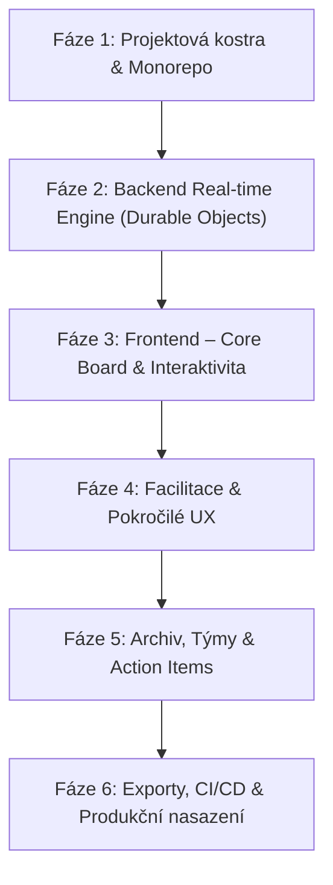

# Detailní plán implementace: CI Retrospective (Cloudflare Native)

Tento dokument rozděluje vývoj retrospektivní aplikace do konkrétních fází a tasků. Každý task obsahuje technický návrh řešení, použité technologie a definici hotového (Acceptance Criteria).

---

## Přehled fází

---

## Fáze 1: Projektová kostra & Monorepo (Sprint 1)

Cíl: Připravit robustní vývojové prostředí s okamžitou typovou bezpečností mezi frontendem a backendem na Cloudflare.

### Task 1.1: Inicializace Monorepa (npm workspaces) ✅ HOTOVO
* **Stav**: Dokončeno (commit `b98cd10`).
* **Implementace**:
  * Vytvořena struktura workspaces:
    * `apps/web`: React 19 + Vite + Lucide icons + @dnd-kit + glassmorphic dark/light design system.
    * `apps/server`: Cloudflare Workers + Hono + Durable Objects (`RetroRoom`).
    * `packages/types`: Zod schémata a TypeScript rozhraní pro board, karty, hlasy a WebSocket protokol.
  * Zaveden sdílený `tsconfig.base.json` s path aliasingem pro okamžitou typovou kontrolu.
  * Ověřena instalace balíčků, `typecheck` napříč všemi workspaces i Vite build.

### Task 1.2: Konfigurace Cloudflare Wrangler & D1 Databáze ✅ HOTOVO
* **Stav**: Dokončeno (commit `74682d0`).
* **Implementace**:
  * Konfigurace `apps/server/wrangler.jsonc` s bindingy pro Cloudflare D1 databázi (`DB`) a Durable Object (`RETRO_ROOM`).
  * Nastaven lokální D1 běh s Miniflare offline emulací bez nutnosti cloudového připojení.

### Task 1.3: Drizzle ORM Schéma & Migrace ✅ HOTOVO
* **Stav**: Dokončeno (commit `74682d0`).
* **Implementace**:
  * Vytvořeno Drizzle ORM schéma v `apps/server/src/db/schema.ts` s tabulkami `retrospectives`, `columns`, `cards`, `votes` a `action_items` včetně cizích klíčů a relací.
  * Zaveden `drizzle.config.ts` a úspěšně vygenerována SQL migrace `migrations/0000_good_master_mold.sql`.
  * Migrace byla úspěšně aplikována do lokální D1 databáze (`npm run db:migrate`).
  * Vytvořeny REST API endpointy v Hono routeru pro tvorbu retrospektiv se šablonami a jejich načítání, napojené na frontendové UI.

---

## Fáze 2: Backend Real-time Engine (Durable Objects) (Sprint 2)

Cíl: Vytvořit stavový serverless engine pro místnosti, který řeší WebSockets, atomické operace a debounced perzistenci do D1.

### Task 2.1: RetroRoom Durable Object & WebSocket Protokol ✅ HOTOVO
* **Stav**: Dokončeno (commit `bd0bc15`).
* **Implementace**:
  * Třída `RetroRoom` dědící z `DurableObject<Env>` s využitím moderního **WebSocket Hibernation API** (`ctx.acceptWebSocket`).
  * Cloudflare automaticky uspává proces při nečinnosti a probouzí při zprávě, čímž šetří výpočetní čas.
  * Kompletní protokol zpráv (připojení, live presence avatary, indikátory psaní).

### Task 2.2: Atomické mutace stavu tabule & Server-Side Maskování (Anti-bias) ✅ HOTOVO
* **Stav**: Dokončeno (commit `bd0bc15`).
* **Implementace**:
  * Atomické operace v `RetroRoom`: přidání, editace, smazání karty, seskupování a atomická kontrola limitu hlasů před zapsáním.
  * **Bezpečné maskování karet na serveru**: Během fáze `BRAINSTORMING` při zapnutém blur server nahrazuje obsah cizích karet za `••••••••••••`, takže text nelze vyčíst ani v DevTools.

### Task 2.3: Dvoustupňová perzistence (DO Paměť + D1 Flush) ✅ HOTOVO
* **Stav**: Dokončeno (commit `bd0bc15`).
* **Implementace**:
  * Real-time mutace probíhají okamžitě v paměti Durable Objectu s odezvou < 2 ms.
  * Debounced automatický flush do Cloudflare D1 databáze po 5 sekundách nečinnosti.

---

## Fáze 3: Frontend – Core Board & Interaktivita (Sprint 3)

### Task 3.1: Design Systém, Layout & Theme Switcher ✅ HOTOVO
* **Stav**: Dokončeno (commit `b98cd10` a `bd0bc15`).

### Task 3.2: WebSocket Client Hook & Room Routing ✅ HOTOVO
* **Stav**: Dokončeno (commit `bd0bc15`).
* **Implementace**:
  * Vytvořen hook `useRetroRoom` spravující WebSocket spojení, reconnect a mutace.
  * Zavedeno URL hash směrování (`#board/:id`), tlačítko pro kopírování sdíleného odkazu, synchronizovaný odpočet času, hlasování a indikátory psaní.
* **Akceptační kritéria**:
  * Plynulá práce i při horším internetovém připojení.
  * Automatické znovupřipojení při výpadku sítě a stažení aktuálního stavu.

### Task 3.3: Komponenty Sloupců a Karet
* **Návrh implementace**:
  * Sloupec (`RetroColumn`):
    * Hlavička s barevným akcentem, počtem karet a tlačítkem `+ Přidat kartu`.
    * Vyhledávání / filtrování karet ve sloupci.
  * Karta (`RetroCard`):
    * Textový obsah s podporou jednoduchého Markdownu (odkazy, tučné písmo).
    * Počet hlasů a tlačítko `+1` / `-1`.
    * Jméno autora (nebo ikona "Anonym").
    * Kontextové menu (editovat, smazat, změnit barvu).
* **Akceptační kritéria**:
  * Uživatel může vytvářet, editovat a mazat své karty.
  * Anonymní karty nezobrazují jméno ani avatar autora.

### Task 3.4: Drag & Drop přetahování a seskupování (@dnd-kit) ✅ HOTOVO
* **Stav**: Dokončeno (commit `eea6b10`).
* **Implementace**:
  * Zapojen `@dnd-kit/core` s pointer sensorem (`DndContext`, `DraggableCard`, `DroppableColumn`).
  * Plynulé přetahování karet mezi sloupci se synchronizací přes WebSocket zprávu `MOVE_CARD`.

---

## Fáze 4: Facilitace & Pokročilé UX (Sprint 4)

### Task 4.1: Synchronizovaný Timer (Odpočet času) ✅ HOTOVO
* **Stav**: Dokončeno (commit `bd0bc15` a `eea6b10`).
* **Implementace**:
  * Časovač řízený serverem v Durable Objectu, synchronizovaný pro všechny účastníky.
  * Zvuková signalizace gongem přes Web Audio API po vypršení času.

### Task 4.2: Maskování karet (Blur/Hide Cards) ✅ HOTOVO
* **Stav**: Dokončeno (commit `bd0bc15`).
* **Implementace**: Bezpečný server-side blur chránící před DevTools nahlížením do cizích myšlenek před odhalením.

### Task 4.3: Šablony retrospektiv & Vlastní sloupce ✅ HOTOVO
* **Stav**: Dokončeno (commit `74682d0`).
* **Implementace**: Přednastavené šablony (*Went Well / To Improve*, *Mad / Sad / Glad*, *Start / Stop / Continue*, *4Ls*, *Custom*).

---

## Fáze 5: Archiv, Týmy & Action Items (Sprint 5)

### Task 5.1: Dashboard retrospektiv & Historie ✅ HOTOVO
* **Stav**: Dokončeno (commit `74682d0` a `bd0bc15`).
* **Implementace**: Přehled všech minulých retrospektiv uložených v Cloudflare D1 databázi.

### Task 5.2: Správa a přenášení Action Items ✅ HOTOVO
* **Stav**: Dokončeno (commit `eea6b10`).
* **Implementace**:
  * Vysouvací boční panel `ActionItemsDrawer` s možností přidávání úkolů, přiřazení lidem a termínů.
  * Zaškrtávání splněných úkolů se synchronizací přes WebSockets do paměti i D1.

### Task 5.3: Autentizace & Guest přístup ✅ HOTOVO
* **Stav**: Dokončeno (commit `bd0bc15`).
* **Implementace**: Rychlý Guest přístup přes sdílený odkaz s automatickou session bez nutnosti registrace.

---

## Fáze 6: Exporty, CI/CD & Produkční nasazení (Sprint 6)

### Task 6.1: Exportní modul (Markdown, CSV, PDF) ✅ HOTOVO
* **Stav**: Dokončeno (commit `eea6b10`).
* **Implementace**:
  * Modální okno `ExportModal` umožňující zkopírovat celou retro na 1 klik do Markdownu (pro Jira/Slack/Confluence), stáhnout tabulkový CSV soubor nebo tisknout do PDF.

### Task 6.2: CI/CD Pipeline & GitHub Actions ✅ HOTOVO
* **Stav**: Dokončeno (commit `eea6b10`).
* **Implementace**:
  * Vytvořen automatický GitHub Actions workflow soubor `.github/workflows/deploy.yml` pro lint, `typecheck`, sestavení frontendu i backendu a nasazení na Cloudflare.
  * Každý push do větve `main` se automaticky nasadí do produkčního prostředí na Cloudflare.
