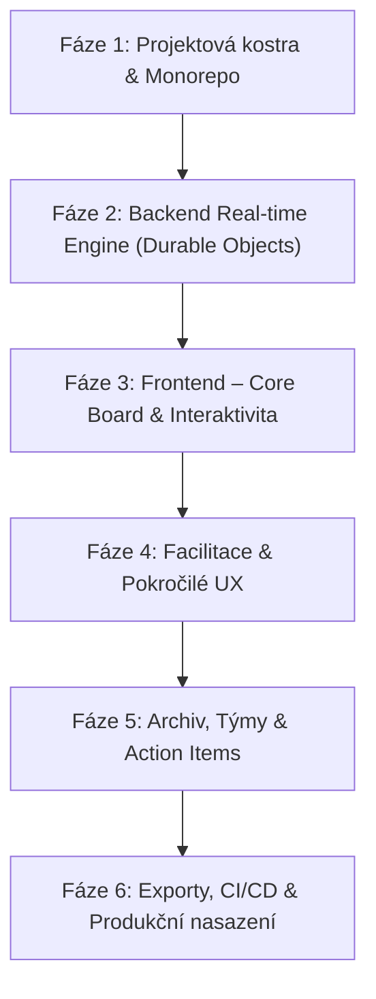

# Detailní plán implementace: CI Retrospective (Cloudflare Native)

Tento dokument rozděluje vývoj retrospektivní aplikace do konkrétních fází a tasků. Každý task obsahuje technický návrh řešení, použité technologie a definici hotového (Acceptance Criteria).

---

## Přehled fází

---

## Fáze 1: Projektová kostra & Monorepo (Sprint 1)

Cíl: Připravit robustní vývojové prostředí s okamžitou typovou bezpečností mezi frontendem a backendem na Cloudflare.

### Task 1.1: Inicializace Monorepa (npm workspaces) ✅ HOTOVO
* **Stav**: Dokončeno (commit `b98cd10`).
* **Implementace**:
  * Vytvořena struktura workspaces:
    * `apps/web`: React 19 + Vite + Lucide icons + @dnd-kit + glassmorphic dark/light design system.
    * `apps/server`: Cloudflare Workers + Hono + Durable Objects (`RetroRoom`).
    * `packages/types`: Zod schémata a TypeScript rozhraní pro board, karty, hlasy a WebSocket protokol.
  * Zaveden sdílený `tsconfig.base.json` s path aliasingem pro okamžitou typovou kontrolu.
  * Ověřena instalace balíčků, `typecheck` napříč všemi workspaces i Vite build.

### Task 1.2: Konfigurace Cloudflare Wrangler & D1 Databáze ✅ HOTOVO
* **Stav**: Dokončeno (commit `74682d0`).
* **Implementace**:
  * Konfigurace `apps/server/wrangler.jsonc` s bindingy pro Cloudflare D1 databázi (`DB`) a Durable Object (`RETRO_ROOM`).
  * Nastaven lokální D1 běh s Miniflare offline emulací bez nutnosti cloudového připojení.

### Task 1.3: Drizzle ORM Schéma & Migrace ✅ HOTOVO
* **Stav**: Dokončeno (commit `74682d0`).
* **Implementace**:
  * Vytvořeno Drizzle ORM schéma v `apps/server/src/db/schema.ts` s tabulkami `retrospectives`, `columns`, `cards`, `votes` a `action_items` včetně cizích klíčů a relací.
  * Zaveden `drizzle.config.ts` a úspěšně vygenerována SQL migrace `migrations/0000_good_master_mold.sql`.
  * Migrace byla úspěšně aplikována do lokální D1 databáze (`npm run db:migrate`).
  * Vytvořeny REST API endpointy v Hono routeru pro tvorbu retrospektiv se šablonami a jejich načítání, napojené na frontendové UI.

---

## Fáze 2: Backend Real-time Engine (Durable Objects) (Sprint 2)

Cíl: Vytvořit stavový serverless engine pro místnosti, který řeší WebSockets, atomické operace a debounced perzistenci do D1.

### Task 2.1: RetroRoom Durable Object & WebSocket Protokol
* **Návrh implementace**:
  * Třída `RetroRoom` dědící z `DurableObject`.
  * Metoda `fetch()` pro WebSocket upgrade handshake: `GET /api/room/:id/ws?user=...`.
  * Ukládání aktivních WebSocket spojení do `Set<WebSocket>` nebo `ctx.getWebSockets()`.
  * Protokol zpráv ve formátu JSON:
    * `JOIN_ROOM`: Registrace účastníka, odeslání kompletního úvodního stavu (`INIT_STATE`).
    * `PRESENCE_UPDATE`: Počet online lidí, seznam přítomných, indikátor psaní ("typing...").
    * `PING / PONG`: Heartbeat mechanismus pro udržení spojení a detekci rozpojení.
* **Akceptační kritéria**:
  * Více klientů se může připojit ke stejné místnosti a vidí se navzájem v seznamu přítomných.
  * Při odpojení klienta jsou ostatní okamžitě notifikováni.

### Task 2.2: Atomické mutace stavu tabule
* **Návrh implementace**:
  * Obsluha událostí uvnitř `RetroRoom`:
    * `ADD_CARD` / `UPDATE_CARD` / `DELETE_CARD`.
    * `MOVE_CARD`: Změna sloupce nebo pořadí karty.
    * `MERGE_CARDS`: Sloučení jedné karty pod druhou (seskupení).
    * `CAST_VOTE` / `REMOVE_VOTE`:
      * **Atomická kontrola limitu**: Pokud má uživatel limit 5 hlasů, Durable Object před započtením ověří `currentVotesCount < maxVotes`.
    * `CHANGE_PHASE`: Přepnutí fáze (Brainstorming -> Hlasování -> Diskuze -> Hotovo).
* **Akceptační kritéria**:
  * Žádný účastník nemůže překročit limit hlasů ani při rychlém vícenásobném kliknutí.
  * Změna karty se okamžitě odvysílá (broadcast) všem připojeným klientům během < 20 ms.

### Task 2.3: Dvoustupňová perzistence (DO SQLite + D1 Flush)
* **Návrh implementace**:
  * 1. stupeň: Okamžitý zápis do lokální SQLite storage uvnitř Durable Objectu (`ctx.storage.sql`).
  * 2. stupeň: Debounced periodický snapshot do centrální D1 databáze (např. každých 30 sekund při změnách nebo při ukončení retro).
  * Ochrana před ztrátou dat při restartu DO.
* **Akceptační kritéria**:
  * Po úplném odpojení všech klientů a následném znovunačtení stránky se obnoví přesný stav místnosti.
  * V D1 databázi jsou data uložena v normalizované relační podobě pro archivní dotazy.

---

## Fáze 3: Frontend – Core Board & Interaktivita (Sprint 3)

Cíl: Moderní, vizuálně prémiový a responzivní React frontend s okamžitou odezvou (Optimistic UI) a drag-and-drop.

### Task 3.1: Design Systém, Layout & Theme Switcher
* **Návrh implementace**:
  * Stylování: Moderní CSS proměnné / Tailwind CSS s přísnou paletou (Slate/Zinc, Indigo/Violet akcenty).
  * Komponenty: Tlačítka, dialogy, dropdowny, tooltipy (Radix UI / Headless).
  * Podpora Dark / Light módu s detekcí preferencí systému a uložením v `localStorage`.
  * Horní navigační lišta: Název retro, stav spojení (Live / Reconnecting), aktivní fáze, avatary přítomných.
* **Akceptační kritéria**:
  * Prémiový vzhled odpovídající moderním SaaS produktům.
  * Plná podpora Dark i Light módu bez problikávání při načtení.

### Task 3.2: WebSocket Client Hook & Optimistic UI
* **Návrh implementace**:
  * Vlastní hook `useRetroRoom(roomId, userSession)`:
    * Spravuje WebSocket spojení, exponential backoff reconnect (1s, 2s, 5s...).
    * Lokální stav místnosti (Zustand nebo useReducer).
    * Optimistické aktualizace: UI okamžitě zobrazí přidanou kartu nebo hlas ještě před potvrzením ze serveru; v případě chyby provede rollback.
* **Akceptační kritéria**:
  * Plynulá práce i při horším internetovém připojení.
  * Automatické znovupřipojení při výpadku sítě a stažení aktuálního stavu.

### Task 3.3: Komponenty Sloupců a Karet
* **Návrh implementace**:
  * Sloupec (`RetroColumn`):
    * Hlavička s barevným akcentem, počtem karet a tlačítkem `+ Přidat kartu`.
    * Vyhledávání / filtrování karet ve sloupci.
  * Karta (`RetroCard`):
    * Textový obsah s podporou jednoduchého Markdownu (odkazy, tučné písmo).
    * Počet hlasů a tlačítko `+1` / `-1`.
    * Jméno autora (nebo ikona "Anonym").
    * Kontextové menu (editovat, smazat, změnit barvu).
* **Akceptační kritéria**:
  * Uživatel může vytvářet, editovat a mazat své karty.
  * Anonymní karty nezobrazují jméno ani avatar autora.

### Task 3.4: Drag & Drop přetahování a seskupování (@dnd-kit)
* **Návrh implementace**:
  * Integrace `@dnd-kit/core` a `@dnd-kit/sortable`.
  * Podpora dvou typů drag interakcí:
    1. **Změna pořadí / Přesun do jiného sloupce**: Karta se zařadí na novou pozici.
    2. **Sloučení (Card Grouping / Merging)**: Přetažení karty přímo na jinou kartu vytvoří skupinu (stack), kde jsou obě myšlenky sloučeny pod jedno téma s agregovanými hlasy.
* **Akceptační kritéria**:
  * Plynulé animace bez trhání.
  * Správné přenesení nové pozice karty všem ostatním účastníkům v reálném čase.

---

## Fáze 4: Facilitace & Pokročilé UX (Sprint 4)

Cíl: Nástroje pro vedení efektivní schůzky bez rušení a zkreslení.

### Task 4.1: Synchronizovaný Timer (Odpočet času)
* **Návrh implementace**:
  * Stav timeru řízený v Durable Objectu: `timerEndsAt: timestamp | null`, `timerDuration: number`.
  * Synchronizovaný odpočet na frontendu (využívá serverový offset času pro eliminaci nepřesnosti hodin klienta).
  * Akce facilitátora: Start (3 min, 5 min, vlastní), Pauza, Přidat +1 minutu, Reset.
  * Zvukový signál (Web Audio API) a vizuální notifikace po vypršení času.
* **Akceptační kritéria**:
  * Všichni účastníci vidí na sekundu přesný zbývající čas.

### Task 4.2: Maskování karet (Blur/Hide Cards)
* **Návrh implementace**:
  * Ve fázi tvorby nápadů (Brainstorming) je text karet ostatních účastníků rozmazaný (`filter: blur(5px)`) nebo zcela skrytý.
  * Každý uživatel vidí nezkresleně pouze své vlastní vytvořené karty.
  * Facilitátor má tlačítko "Odhalit všechny karty", které přepne board do fáze čtení/seskupování.
* **Akceptační kritéria**:
  * Zabraňuje stádovému efektu (tým nepíše to samé, co vidí u ostatních).
  * Bezpečné skrytí (text karet se ve fázi blur neposílá v plain-textu ostatním klientům, aby ho nešlo vyčíst z DOM/Network).

### Task 4.3: Šablony retrospektiv & Vlastní sloupce
* **Návrh implementace**:
  * Knihovna předpřipravených šablon:
    * *Went Well / To Improve / Action Items*
    * *Mad / Sad / Glad*
    * *Start / Stop / Continue*
    * *4Ls: Liked / Learned / Lacked / Longed For*
    * *Sailboat (Wind / Anchor / Rocks / Island)*
  * Možnost přidávat, mazat, přejmenovávat a přebarvovat sloupce.
* **Akceptační kritéria**:
  * Při tvorbě nové retrospektivy si uživatel vybere šablonu 1 kliknutím.

---

## Fáze 5: Archiv, Týmy & Action Items (Sprint 5)

Cíl: Dlouhodobé sledování výsledků, správa týmů a kontinuita úkolů.

### Task 5.1: Dashboard retrospektiv & Historie
* **Návrh implementace**:
  * Přehled proběhlých i plánovaných retrospektiv.
  * Možnost přepnout ukončenou retrospektivu do režimu "Read-only" (archiv).
  * Vyhledávání podle klíčových slov a filtrování podle šablony nebo data.
* **Akceptační kritéria**:
  * Tým se může kdykoliv vrátit k retrospektivě staré několik měsíců.

### Task 5.2: Správa a přenášení Action Items
* **Návrh implementace**:
  * Vyhrazený sloupec nebo panel pro Akční kroky (Action Items).
  * Každý úkol má: popis, přiřazeného člena (assignee), termín a stav (Otevřeno / Hotovo).
  * **Funkce "Přenést nedokončené úkoly"**: Při startu nové retrospektivy se automaticky nabídne import otevřených úkolů z minulé retro schůzky.
* **Akceptační kritéria**:
  * Žádný domluvený úkol nezapadne mezi dvěma sprinty.

### Task 5.3: Autentizace & Guest přístup
* **Návrh implementace**:
  * Dvouúrovňový model přístupu:
    1. **Guest (Bez registrace)**: Přístup přes odkaz `ci-retro.app/room/:code`. Účastník zadá pouze své jméno (nebo "Anonym").
    2. **Host / Facilitátor (Účet)**: Přihlášení přes Google / GitHub OAuth nebo Magic Link pro správu týmů, trvalé ukládání a historii.
* **Akceptační kritéria**:
  * Členové týmu se mohou připojit během 3 sekund bez vytváření účtu.

---

## Fáze 6: Exporty, CI/CD & Produkční nasazení (Sprint 6)

Cíl: Snadné sdílení výstupů a automatizovaný provoz na Cloudflare.

### Task 6.1: Exportní modul (Markdown, CSV, PDF)
* **Návrh implementace**:
  * Klientské generování:
    * **Markdown / Plaintext**: Formátovaný přehled připravený ke zkopírování do Jira ticketu, Confluence nebo Slacku.
    * **CSV export**: Pro tabulkovou analýzu.
    * **Tisk do PDF**: Čistý tiskový CSS layout (`@media print`).
* **Akceptační kritéria**:
  * Export hotový na 1 klik bez zátěže serveru.

### Task 6.2: CI/CD Pipeline & GitHub Actions
* **Návrh implementace**:
  * GitHub Actions workflow:
    * `lint-and-typecheck`: Ověření TypeScript typů a ESLint.
    * `deploy-backend`: Automatické nasazení Cloudflare Workeru a migrací přes `wrangler deploy`.
    * `deploy-frontend`: Automatické sestavení a nasazení na Cloudflare Pages.
* **Akceptační kritéria**:
  * Každý push do větve `main` se automaticky nasadí do produkčního prostředí na Cloudflare.
